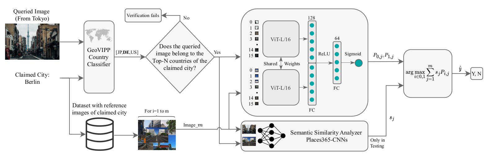

<div align="center">
 
# A Siamese Based System For City Verification

[](https://ecai2023.eu/)

</div>

This is the official GitHub page for the paper:

> Omran Alamayreh, Jun Wang, Giovanna Maria Dimitri, Benedetta Tondi and Mauro Barni:
"A Siamese Based System For City Verification".
In: ECAI.



## Download Dataset

```bash
pip install gdown
gdown https://drive.google.com/uc?id=1Xc3YxdAQoCztFmYgIBZZc0Kq6-XWGT0a
```

## Reproduce Results

Train a verifier (ViT 16 from ImageNet). 

```bash
python3 train_vit_siamese.py --config config/siamese_vit.yml
```

Afterwards, perform verification and store the results for each image pair.

```bash
verifier.sh
```

Finally, use an analysis script to obtain the final results.

```bash
python3 generate_tables_vit.py --set open  --thr 0.6 --GeoVIPP --Similarity
```


## Citation
```BibTeX
@inproceedings{,
  author    = {Omran Alamayreh, Jun Wang, Giovanna Maria Dimitri, Benedetta Tondi and Mauro Barni},
  title     = {A Siamese Based System For City Verification},
  booktitle = {},
  volume    = {},
  pages     = {},
  publisher = {},
  year      = {},
  url       = {},
  doi       = {},
}
```


## Licence
This work is published under the GNU GENERAL PUBLIC LICENSE Version 3, 29 June 2007. For details please check the
LICENSE file in the repository.
